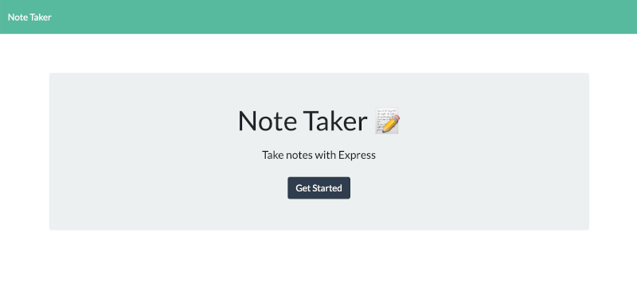
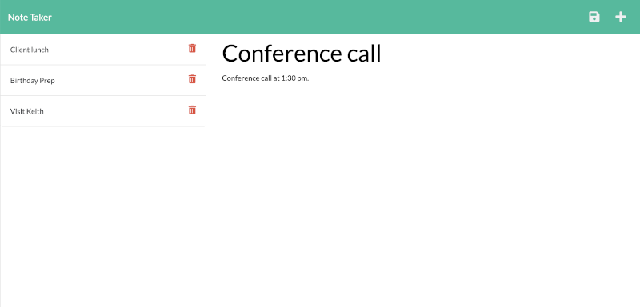

## Note Taker

This app is a browser-based organiser that keeps track of thoughts and tasks. The app has both frontend and backend connected and is deployed to Heroku. The app can be a accessed [here](https://note-taker-kcsheng.herokuapp.com/).

### Features

- Ability to add note title and text that persist in designated database.
- Ability to remove title and text if the user wishes to do so.
- Integration of the frontend and backend (express js)

### UI demo

---

